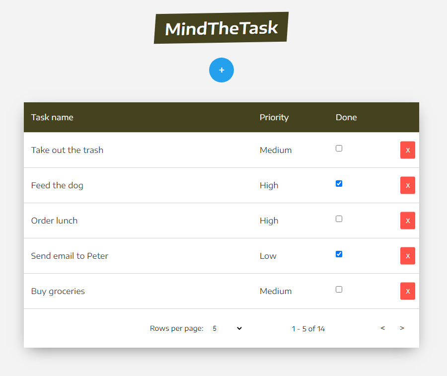

# MindTheTask

</br>

<p align="center">
  
</p>

## :pencil: Description

MindTheTask is a simple TODO list.

## :wrench: Tools

**The following tools were used in project:**

- **React**
- **Hooks**
- **Redux**
- **Styled-Components**

## :construction_worker: Installation

```bash
git clone https://github.com/eszczepan/MindTheTask.git
npm install
npm start
```

## :movie_camera: Live

https://mindthetask.netlify.app/
